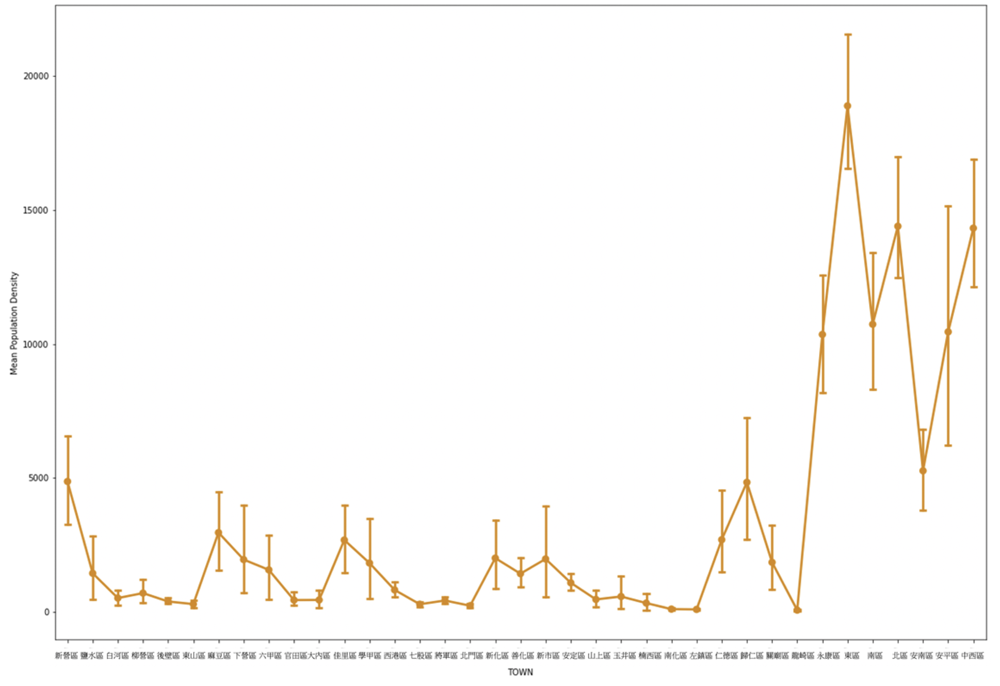
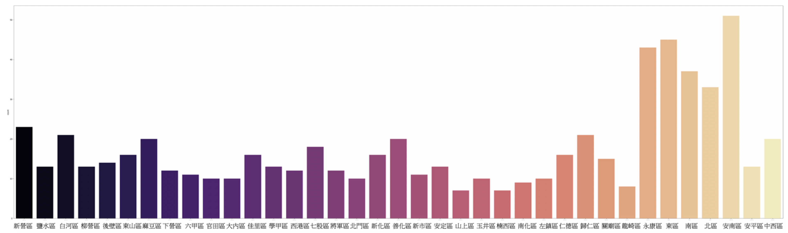
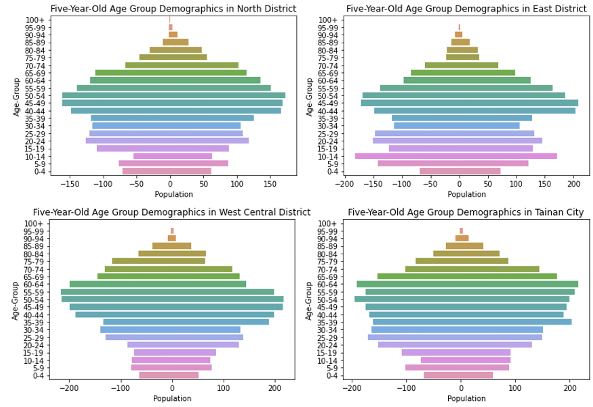
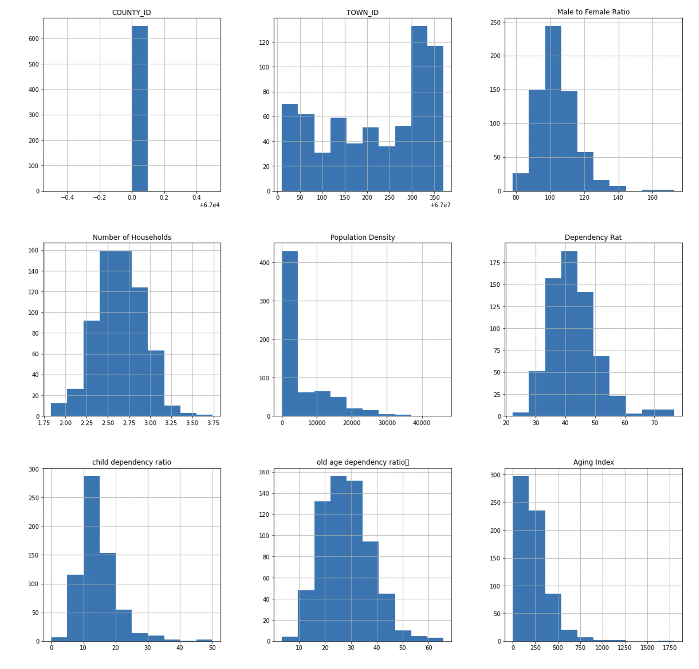
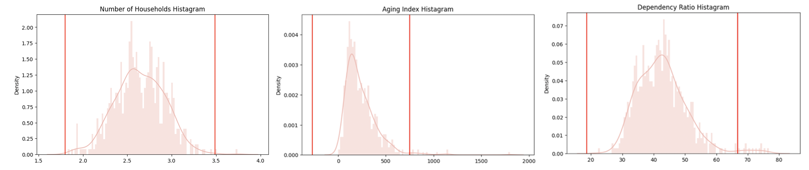
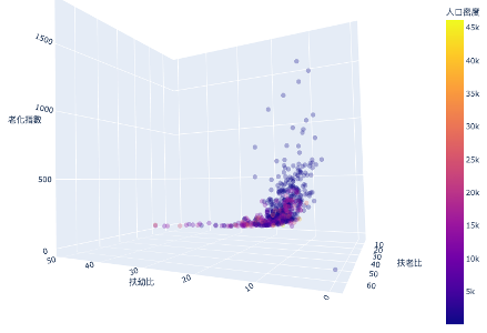

# Population_Index_Visualization

This research explores population phenomena in the North, West Central, and East districts surrounding the National Cheng Kung University campus in Tainan City. Data for this study was obtained from various sources, including the government open data platform, Tainan City Civil Affairs Bureau, Social and Economic Data Service Platform, Tainan City Central-Western Household Registration Office, Tainan City Northern Household Registration Office, and Tainan City Eastern Household Registration Office. The GIS (version 3.16) and Excel (version 16.60) were used to process the data, and statistical data processing and visualization were conducted using Google Colab (Python 3.7.13).

To provide a detailed analysis of the population composition, population distribution, density maps, and various population indicators, the study used village boundaries as spatial units for analysis and combined them with district boundaries for a comprehensive overview. Based on the 110-year data, the following map data processing was completed:

# 1.Population trend and relative growth analysis:
- National, Tainan City, and district-level population growth rate.
- Population distribution and density for each district in the study area.

- The line chart of the average population density of villages in various districts of Tainan City in the year 2021.

- The distribution of the number of villages in each district of Tainan City  in the year 2021.

# 2.Population structure analysis:

- 2021 Population Pyramid Charts for North District, East District, West Central District, and Tainan City.

# 3.Population indicator analysis:
- Gender ratio for each village.
- Natural increase rate for each district in Tainan City.
- Birth rate, death rate, marriage rate, and divorce rate for each district in Tainan City.
- Social increase rate for each district in Tainan City.
- Doctoral and master's degree population for Tainan City and the study area.
- Inflow and outflow for Tainan City and the study area, including the number of residents moving in and out of the city from other counties and the city itself.

- Histogram matrix of population indicators for Tainan City.

- Histogram of the number of households, elderly index, and dependency ratio by district in Tainan City in 2021.

# 4.Population cross-analysis:
- 3D scatter plot and correlation matrix of population indicators for each village in Tainan City.

- 3D scatter plot of demographic indicators (dependency ratio of children, dependency ratio of elderly, aging index, and population density) for each neighborhood in Tainan City.
- Regression and scatter plots of population indicators for each village.
- Two-dimensional abnormal value detection of population indicators for each village.
- Parallel coordinate of population indicators for each village.

